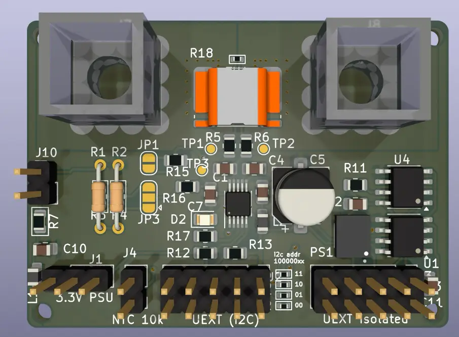
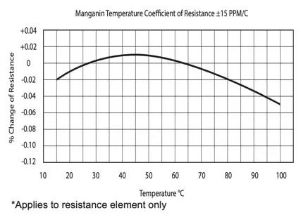
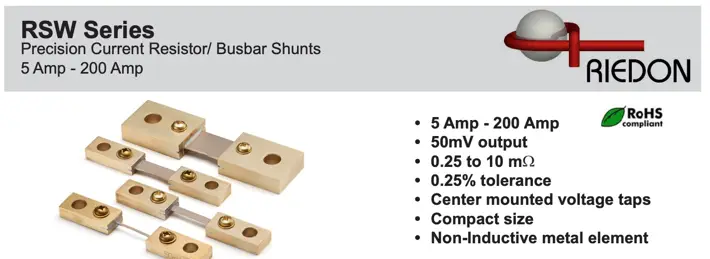
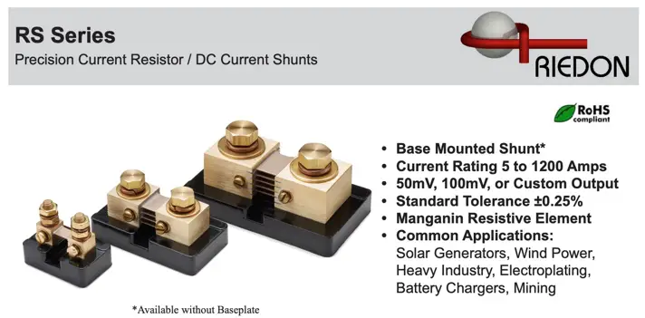
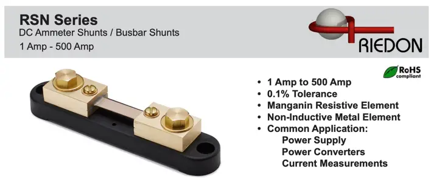

A versatile lab power monitor.
I wrote this for precision power metering and testing DCDC converters.

# Building

## Platformio Setup
* [install script](https://docs.platformio.org/en/latest/core/installation/methods/installer-script.html)
* [setup shell commands](https://docs.platformio.org/en/latest/core/installation/shell-commands.html)
* [clion](https://docs.platformio.org/en/latest/integration/ide/clion.html)

select the board:

`pio run -e esp32`
or 
`pio run -e esp32s3`

# TODO

- add ssa-100 plug?
- add ntc
- add pin header for chassis mount resistor
- jumper to disconnect on-board shunt?
- add RSN-50-50 footprint (no available)
- add external alert (for OC shutdown)
- add external IO pins?

Supported ADC:

* ADS1115 / ADS 1015 (with SSA-100)
* INA226
* INA228

On startup it detects the ADCs on the I2C bus using there default addresses.

I tested it on these MCUs:

* ESP8266
* ESP32
* ESP32-S3

The program reads voltage and current and computes power.
It integrates power for energy measurement using the trapezoidal rule.

# Output

* Serial (human friendly logs)
* UDP messages using InfluxDB line protocol

# Current Sense Resistors

|                |                    | mΩ | P   | tol | temp          | padW/mm | padH/mm | KelvinCon | px100 |
|----------------|--------------------|----|-----|-----|---------------|---------|---------|-----------|-------|
| isabellenhütte | BVR-Z-R0003-1.0    | .3 | 11W | 1%  | 20ppm         | 5.5     | 1.6     | y         | $1.9  |
| bourns         | CSS2H-2512R-L300F  | .3 | 6W  |     | 150ppm(50ppm) | 3.4     | 1.8     | n         | $     |
| Milliohm (CN)  | HoLRS5930-0.3mR-1% | .3 | 7W  | 1%  | 50ppm         | 7.6     | 4.2     | n         | $.24  |
| vishay         | WSLP5931L3000FEA   | .3 | 10W | 1%  | 175ppm        | 7.75    | 5.2     | n         | $1.7  |
| RESI (CN)      | SEWF3951DL300P9    | .3 | 15W | .5% | 25ppm         | 13      | 2       | n         | $2.2  |
| VPG            | Y14880R00100D0R    | 1  | 3W  |     |               |         |         |           |       |
| isabellenhütte | BVR-Z-R0005-1.0    |    |     |     |               |         |         |           |       |
|                | BVR-M-R0007-1.0    | .7 | 8W  | 1%  | 20ppm         |         |         |           |       |

Chip Mount Resistors 40ppm 1mΩ https://www.digikey.de/short/8dbrqrp4

Chip Mounts with >=1mΩ usually have 50ppm/K temp drift.
Choose Chassis Mount resistor, suchs as the 1mOhm RSN-100-100B with 15ppm/k

# Chassis Mount Resistors

These commonly have lower tolerance and lower temp drift as compared to chip mount.
The larger surface of the resistive material decreases thermal resistance to ambient.

|  |
|:-----------------------:|
|       Riedon RSN        |

With a tolerance constraint of 0.1% measuring temperature is not necessary.

Riedon RSW

|                  |   |       |       |
|------------------|---|-------|-------|
| Riedon RSW-50-50 | 1 | 0.25% | 15ppm |
|                  |   |       |       |

# 30A

ina228 has a shunt voltage range of 40.96 and 163.84 mV.
at a voltage drop of 40mV and 30A, we have 1.2 W of heat dissipation.

# applications

* bms/battery current sennsor
* smart shunt / lab shunt
* solar crowbar
* efuse
* mppt sensor

# set conversion time and averaging

* consder aliasing
* the ina22x ADC samples AND we sample the ina22x
* use conversion time to avoid aliasing during ADC
* use averaging to avoid aliasing during sampling the ina22x (i2c)
* when working with 50hz inverters, need a conversion time <=1ms.

# precision

* note that resistors change there resistance with temperature (see datasheet)
* use precision resistors
* keep temperature stable
* when measurement DCDC converter efficiency use 2x identical hardware. same chips and same resistors
* INA228 temp coefficient is 20ppm/°C, so choose resistor in that class
    * Ina228 features a temperature sensor

# AC Metrology

* Ti Design TIDU455A (MSP430AFE253, 24 Bit DeltaSigma ADC), class 0.2% accuracy
* Ti Eval Board EVM430-I2040S (MSP430I2040, 24bit, 8Khz or 80th harmonic of 50 Hz), <0.2% accuracy
    * AC, DC, 380V, 15 Amps
* Gossen Metrawatt Metrahit Energy (Starline Series) and
  Open-Source [IrDA USB](http://lemmini.de/IrDA%20USB/IrDA%20USB.html) (the Gossen USB X-Tra needs proprietary drivers,
  for windows only)
    * ESP32 has `UART_MODE_IRDA`, you only need the TFDU4101 [forum1](https://esp32.com/viewtopic.php?t=2766)

# EVM430

- the software "calibrator-20121120.exe" referenced in the datasheet is out-dated. I could not find a downlo
- use [MSP-EM-DESIGN-CENTER](https://www.ti.com/tool/MSP-EM-DESIGN-CENTER)
  , [intro](https://software-dl.ti.com/msp430/msp430_public_sw/mcu/msp430/EnergyMeasurementDesignCenter/1_40_00_03/release/EnergyMeasurementDesignCenter_1_40_00_03/docs/users_guide/html/Energy_Measurement_Technology_Guide_html/markdown/ch_designcenter.html)
  . works on Windows, Mac, Linux
- voltage sense (C14)  pin 1 and 2, A0.0+ and A0.0-
- Current Sense (C10) pin 3 and 4, A1.0+ and A1.0-
- there is a project "EVM430-i2040S_SH_1V_1C_50Hz"
- Double click the MCU and "Generate Code"
- Open generated src code project with CCSTUDIO
    - Could not get the online version to open the project (https://dev.ti.com/ide/)
    - the download IDE based on eclipse succeeded to build the generated project, but need MSP-FET programmer. not sure
      if an ordinary USB2UART addapter works?

# Isolated Current Sensor

DC-DC: MIE1W0505BGLVH-3R-Z (monolithic) 
i2c: TPT72616-SO1R (3peak)