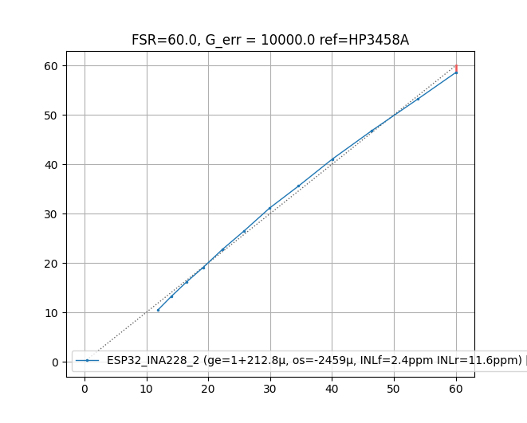
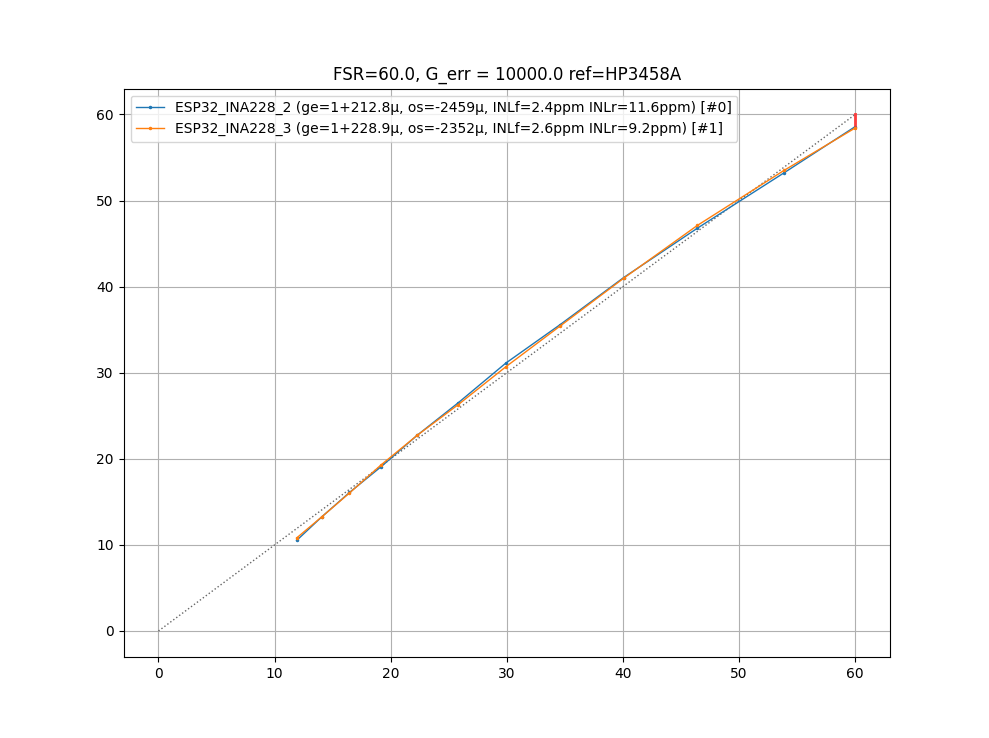
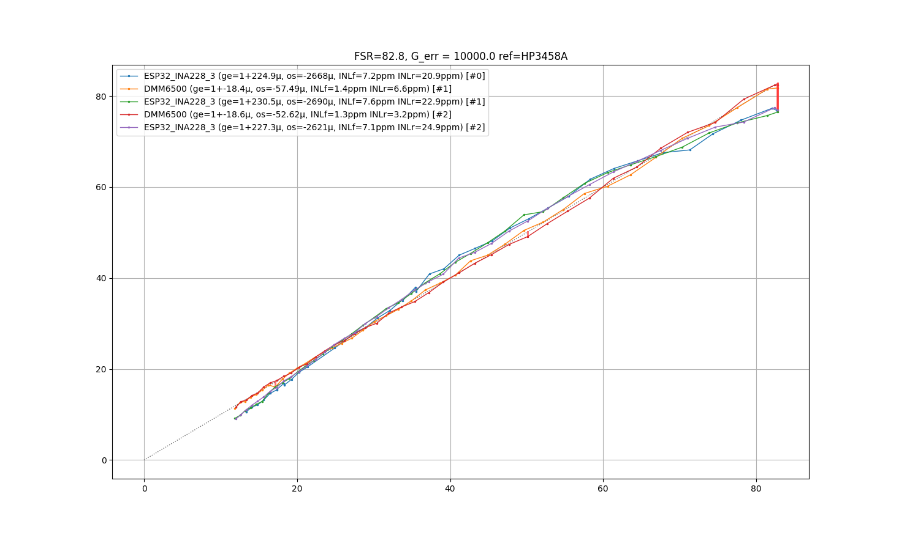

* datasheet says INL(typ) = 20ppm
* Linearity can be improved with a second order polynom (~2ppm INL)
* polynom is the same for the three tested chips
* non-linearity does not appear to drift
* gain drifts, need to calibrate gain before each measurement
* offset didnt drift across measurements

# INL

- reference HP3458A (nplc=10)
- good INL
- suitable for polyfit
- only Vbus+dietemp measured (conversion time ~4000us)

across devices the curve looks pretty much the same:

going up to 82V reveals more linear error (the DMM6500 continues to do its job very well):

notice these measurements where only taken for 90s each with some noise on the power supply.

here is a measurement with another less noisy power supply and 900s (15min) measurements:
TODO 

this looks like we can do a polyfit, and indeed it helps.

# Noise

# etc

current measurements seem to suffer from crosstalk from bus voltage. it changes the offset voltage.
for better precision, use one ina228 for current only and the other for voltage only.
Vbus INL is quite good.
TODO need to measure INL for current

Ina228 with ESP32-S3, WiFi connected

The Esp32 produces significant heat.

Current sense input:
10 ohm series resistors and 100nF cap

6h drift, temperature droping at night: (Vbus open clamps)

suddenly, there was an unexplainable drop for 45 minutes:

shortings Vbus to GND:

- offset voltage of current amp falls near zero.
- ADC temperature rises (due to more conversion iterations?)
- after opening Vbus again it returns to the same offset as before
- connecting a 3.2V battery doesnt change a lot

# Offset Voltage

- best to connect shunt to circuit GND
- change Vbus from 0 to 60V -> current offset voltage changes by 1.4µV
- 